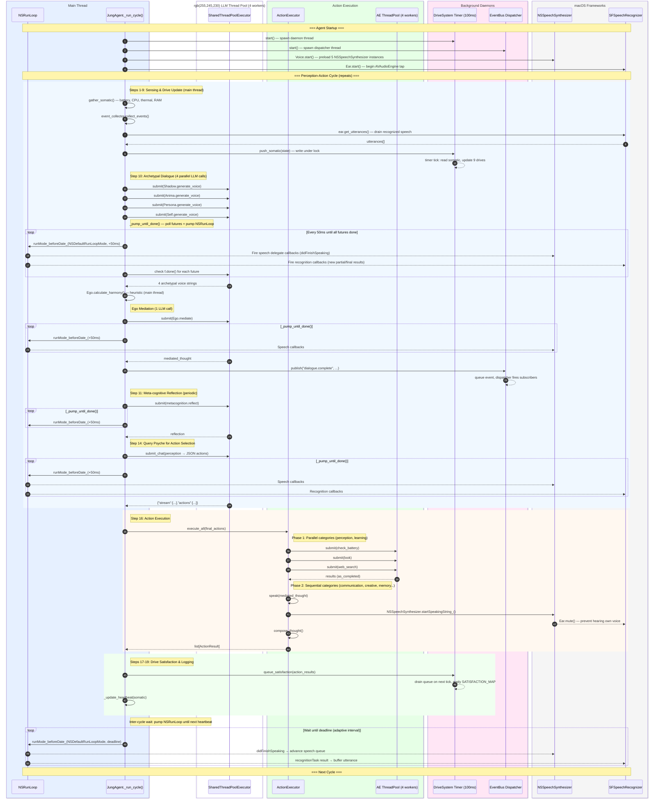
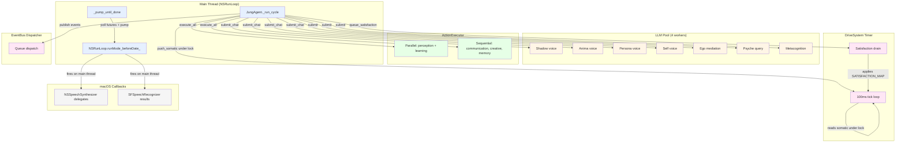

# Concurrency Model: NSRunLoop / ThreadPool / ActionExecutor

> Sequence diagram documenting the interaction between NSRunLoop, the shared
> ThreadPoolExecutor, the ActionExecutor, the DriveSystem timer, and the
> EventBus dispatcher. Reference: `sociopsi-architecture.tex` Section 5.

## Thread Inventory

| Thread | Lifecycle | Purpose |
|--------|-----------|---------|
| **Main (NSRunLoop)** | Process lifetime | Perception-action cycle, voice/speech callbacks |
| **DriveSystem Timer** | `start()`..`stop()` daemon | Tick drives at 100ms, drain satisfaction queue |
| **EventBus Dispatcher** | `start()`..`stop()` daemon | Dispatch subscribed events from queue |
| **llm-worker-0..3** | Lazy singleton pool | LLM inference (Ollama/Anthropic) |
| **ActionExecutor pool** | Per `execute_all()` | Parallel perception/learning actions |

## Key Constraint

macOS `NSSpeechSynthesizer` and `SFSpeechRecognizer` deliver callbacks on the
main thread via `NSRunLoop`. The main thread **cannot block** on LLM calls
(~18s for Cydonia 22B). The solution is `_pump_until_done()`: poll futures in
50ms intervals while pumping `NSRunLoop.runMode_beforeDate_()`.

## Sequence Diagram

## Data Flow Between Threads

## Thread Safety Notes

1. **AppKit is not thread-safe.** All `NSSpeechSynthesizer` and
   `SFSpeechRecognizer` interactions must happen on the main thread. The
   `_pump_until_done()` pattern ensures this by running `NSRunLoop` while
   waiting for LLM futures.

2. **DriveSystem somatic state** is shared between the main thread (writes via
   `push_somatic()`) and the timer thread (reads during tick). Access is
   protected by `threading.Lock`.

3. **Satisfaction queue** uses `queue.Queue` (thread-safe) to pass action
   results from the main thread to the drive timer thread.

4. **EventBus subscriptions** are guarded by `threading.Lock`. Event dispatch
   happens on the dispatcher thread; handler exceptions are caught to prevent
   one failing subscriber from crashing the bus.

5. **SharedThreadPoolExecutor** is a module-level singleton in `llm.py`
   (4 workers, `llm-worker` prefix). It is lazily initialized and shared
   across all LLM callers (dialogue, psyche query, metacognition, planning).

6. **ActionExecutor** creates a **separate** `ThreadPoolExecutor` (4 workers)
   per `execute_all()` call for parallel action categories, plus per-action
   timeout pools. These are independent of the LLM pool.

## Timing Budget (typical cycle)

| Phase | Duration | Bottleneck |
|-------|----------|------------|
| Sensing (steps 1-9) | ~50ms | `gather_somatic()` subprocess calls |
| Archetype voices (step 10) | ~18s | 4 parallel Cydonia 22B inferences |
| Ego mediation (step 10) | ~18s | 1 Cydonia 22B inference |
| Metacognition (step 11) | ~18s | 1 inference (every 30s) |
| Psyche query (step 14) | ~18s | 1 Cydonia 22B inference |
| Action execution (step 16) | 1-30s | Varies by action category |
| **Total cycle** | **~55-75s** | **LLM inference dominates** |

During all LLM waits, `_pump_until_done()` keeps the NSRunLoop alive so
voice playback continues and speech recognition results are delivered.
